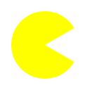
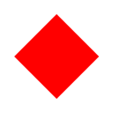
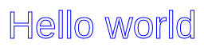

# canvas-paint
> Helper functions for drawing to `<canvas>` elements

## install
```sh
npm install canvas-paint
```

## usage
```js
const { fill, clear, ... } = require('canvas-paint')
```

### `fill(canvas, color)`
Fills the entire `canvas` with [`color`](https://developer.mozilla.org/en-US/docs/Web/CSS/color_value).
```js
fill(canvas, 'black')
```

### `clear(canvas, rect?)`
Clears the region on `canvas` as specified by `rect`.
```js
clear(canvas, {
  x: canvas.height / 4,
  y: canvas.height / 4,
  width: canvas.width / 2,
  height: canvas.height / 2
})
```
If `rect` is not provided, the entire canvas will be cleared.

### `rect(canvas, options)`
```js
rect(canvas, {
  x: 50,
  y: 25,
  width: 100,
  height: 50,
  fill: 'red'
})
```

### `circle(canvas, options)`
```js
circle(canvas, {
  x: canvas.width / 2,
  y: canvas.height / 2,
  radius: 32,
  stroke: {
    color: 'blue',
    width: 2
  }
})
```

### `arc(canvas, options)`
```js
arc(canvas, {
  x: canvas.width / 2,
  y: canvas.height / 2,
  radius: 48,
  start: 120,
  end: 60,
  fill: 'yellow'
})
```
The above code draws the following image:



Note that `start` and `end` are provided in angles instead of radians. Also, the `anticlockwise` parameter has been omitted. The values for `start` and `end` can be switched in order to achieve the same result.

### `line(canvas, options)`
```js
line(canvas, {
  start: { x: 50, y: 25 },
  end: { x: 125, y: 5 },
  stroke: {
    color: 'black',
    width: 2
  }
})
```

### `polygon(canvas, options)`
Draws a polygon onto `canvas`.
```js
polygon(canvas, {
  points: [
    { x: 64, y: 16 },
    { x: 112, y: 64 },
    { x: 64, y: 112 },
    { x: 16, y: 64 },
  ],
  fill: 'red'
})
```
The above code draws the following image:



### `image(canvas, options)`
```js
paint.image(canvas, {
  image: sprites.wall,
  x: 32,
  y: 16,
  width: sprites.wall.width * 2,
  height: sprites.wall.height * 2
})
```
`width` and `height` are optional - they will default to `image.width` and `image.height` if not provided.

### `text(canvas, options)`
```js
text(canvas, {
  text: 'Hello world',
  x: canvas.width / 2,
  y: canvas.height / 2,
  align: 'center',
  baseline: 'middle',
  font: {
    size: 48,
    family: 'sans-serif'
  },
  stroke: {
    color: 'blue'
  }
})
```
The above code draws the following image:



Additionally, a couple of minor changes have been made to the API defaults.
- `font.size` defaults to `16`
- `align` defaults to `'left'`
- `baseline` defaults to `'top'`

## license
[MIT](https://opensource.org/licenses/MIT) © [Brandon Semilla](https://git.io/semibran)
